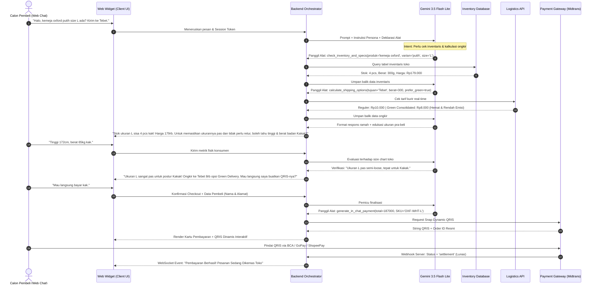

# PRODUCT REQUIREMENT DOCUMENT (PRD) & FRAMEWORK INOVASI SISTEM
## CLOSIFY AI: Autonomous Conversational Sales & Closing Agent untuk Ekosistem D2C E-Commerce

| Parameter Dokumen | Deskripsi Detail |
| :--- | :--- |
| **Nama Inovasi** | **Closify AI** (*Autonomous Conversational Sales & Closing Agent*) |
| **Konteks & Fungsi Dokumen** | Dokumen Acuan Desain Produk, Arsitektur Sistem, dan Landasan Konseptual Essai Inovasi (KIMNAS UNESA) |
| **Platform Implementasi** | *Web-Based Embedded Application* (Widget Terintegrasi Langsung pada Situs Bisnis) |
| **Foundation Model** | Google Gemini API (Google AI Studio / **Gemini 3.5 Flash Lite**) |
| **Target Sektor** | *Direct-to-Consumer* (D2C) E-Commerce, UMKM Digital, & Brand Fesyen/Gaya Hidup Lokal |
| **Fokus Solusi** | Menutup Kebocoran Konversi Penjualan (*Cart Abandonment*), Menekan Angka Retur Barang (*Zero Return Protocol*), dan Mengotomasi Transaksi Instan di Dalam Chat (*In-Chat Checkout*) |

---

## 1. Latar Belakang & Urgensi Masalah (The Problem & Market Pain Points)

Pertumbuhan belanja daring di Indonesia didominasi oleh pergeseran ke kanal *Direct-to-Consumer* (D2C) di mana *brand* membangun identitas dan situs web mandiri guna menghindari potongan komisi *marketplace* yang semakin tinggi. Namun, situs e-commerce mandiri menghadapi tiga kebocoran operasional dan finansial yang sangat krusial:

```
┌─────────────────────────────────────────────────────────────────────────────┐
│                       3 TITIK KRITIS KEGAGALAN E-COMMERCE D2C               │
├──────────────────────────────┬──────────────────────────────┬───────────────┤
│ 1. Cart Abandonment (70.19%) │ 2. Krisis Retur Fesyen (30%) │ 3. Support vs │
│ Friksi alur checkout panjang │ Pembeli ragu ukuran produk,  │ Closing Void  │
│ & dialihkan keluar website   │ barang salah ukuran & retur  │ Chatbot kaku, │
│ menyebabkan transaksi batal. │ membebani biaya logistik.    │ admin lelet.  │
└──────────────────────────────┴──────────────────────────────┴───────────────┘
```

1. **Tingginya Angka Pengabaian Keranjang (*Cart Abandonment Rate* hingga 70,19%):**
   Konsumen modern memiliki rentang perhatian (*attention span*) yang sangat singkat. Alur belanja konvensional mengharuskan konsumen menavigasi multi-tab: *Cari Produk $\rightarrow$ Pilih Varian $\rightarrow$ Masuk Keranjang $\rightarrow$ Isi Form Alamat Panjang $\rightarrow$ Pilih Ekspedisi $\rightarrow$ Redirect Halaman Pembayaran*. Setiap penambahan langkah (*friction point*) meningkatkan risiko pembatalan pembelian secara eksponensial.
2. **Krisis Retur Produk Akibat Keraguan Spesifikasi (*Sizing & Fitting Dilemma*):**
   Pada sektor fesyen dan gaya hidup lokal, tingkat pengembalian barang (*return rate*) berkisar antara 20% hingga 30%. Penyebab utamanya adalah ketidaksesuaian ukuran (*fit issue*). Retur tidak hanya menggerus margin keuntungan pelaku bisnis (biaya logistik ganda dan penanganan ulang stok), tetapi juga menyumbang jejak karbon armada transportasi yang tidak efisien.
3. **Kekosongan Peran Tenaga Penjual Aktif (*The Conversational Sales Void*):**
   * **Chatbot Konvensional (Rule-Based):** Bersifat pasif, hanya melayani FAQ dasar ("Toko buka jam berapa?", "Bisa kirim ke mana?"), kaku, dan tidak memiliki kecerdasan persuasif untuk memandu transaksi hingga tuntas.
   * **Staf Admin Penjualan Manusia:** Mengalami keterbatasan jam kerja (tidak aktif 24/7), latensi respons lambat saat jam sibuk/malam hari (rata-rata $> 15$ menit), dan biaya operasional gaji sif malam yang membebani kas UMKM.

---

## 2. Visi Produk & Landasan Konseptual Inovasi (Core Concepts & Novelty)

**Closify AI** didesain bukan sebagai *customer support bot*, melainkan sebagai **Autonomous Digital Sales Closer**—sebuah entitas AI cerdas yang mereplikasi keahlian pramuniaga toko fisik terbaik langsung ke dalam layar belanja digital konsumen.

### Paradigma Perubahan: Dari "Support Pasif" ke "Closing Aktif"

```
[Chatbot CS Tradisional]  ──(Reaktif)──> Hanya menjawab pertanyaan yang diajukan pengguna
                                           Tanpa inisiatif transaksi.

[Closify AI Agent]       ──(Proaktif)──> Menganalisis Kebutuhan ──> Validasi Ukuran (Ergonomis)
                                           ──> Opsi Pengiriman Hijau ──> Checkout QRIS Instan
```

### Tiga Pilar Konseptual Utama

#### A. Pilar 1: Frictionless In-Chat Native Checkout
* **Konsep:** Memangkas seluruh tahapan *checkout* konvensional menjadi satu alur percakapan terpadu.
* **Mekanisme:** Konsumen tidak perlu membuka keranjang belanja atau dialihkan ke tautan eksternal. Agen langsung menerbitkan kartu transaksi (*invoice card*) interaktif dan menampilkan **Dynamic QRIS** resmi di dalam jendela obrolan web. Status pembayaran dipantau secara *real-time* melalui WebSocket sehingga begitu dana masuk, status seketika berubah menjadi *"Pesanan Terkonfirmasi"*.

#### B. Pilar 2: Zero Return Protocol (Presales Fit & Ergonomic Consultation)
* **Konsep:** Mencegah masalah retur sebelum transaksi terjadi (*proactive return mitigation*).
* **Mekanisme:** Sebelum menerbitkan tagihan untuk produk rentan salah ukuran (seperti kemeja, celana, sepatu), agen secara proaktif menginisiasi konsultasi dimensi fisik (*"Boleh tahu perkiraan tinggi dan berat badan Kakak? Kami bantu pastikan ukurannya pas di badan agar tidak perlu tukar barang nanti."*). Sistem mencocokkan data tubuh konsumen dengan *size-chart matrix* toko secara deterministik.

#### C. Pilar 3: Sustainable Logistics Nudging (Green Delivery Option)
* **Konsep:** Mendorong kesadaran lingkungan konsumen melalui insentif pengiriman terkonsolidasi (*consolidated green delivery*).
* **Mekanisme:** Saat menghitung ongkir melalui API logistik, agen menawarkan opsi pengiriman ramah lingkungan dengan jadwal konsolidasi rute kurir terencana untuk mengurangi emisi bahan bakar armada pengiriman.

---

## 3. Analisis Lanskap Industri & Evaluasi Kesenjangan (Gap Analysis terhadap Halo AI)

Di pasar Indonesia saat ini, platform seperti **[Halo AI](https://www.haloai.co.id/)** telah muncul sebagai tolok ukur (*benchmark*) otomatisasi percakapan bisnis. Namun, terdapat kesenjangan mendasar antara kapabilitas Halo AI dengan kebutuhan spesifik penutupan penjualan di situs web e-commerce.

```
┌─────────────────────────────────────────────────────────────────────────────┐
│                 PERBANDINGAN STRATEGIS: HALO AI vs CLOSIFY AI               │
├──────────────────────────────┬──────────────────────────────────────────────┤
│ HALO AI (haloai.co.id)       │ CLOSIFY AI (Inovasi Kita)                    │
│ • Fokus: Omnichannel CRM WA  │ • Fokus: In-Website Sales Closer & Checkout  │
│ • Jalur: Chatting Eksternal  │ • Jalur: Embedded Langsung di Situs E-Com    │
│ • Checkout: Kirim Link Luar  │ • Checkout: Native In-Chat Dynamic QRIS      │
│ • Fitur: FAQ & Support Umum  │ • Fitur: Zero Return Protocol & Green Nudge  │
│ • LLM: General Multi-Model   │ • LLM: Gemini 3.5 Flash Lite + Guardrails    │
└──────────────────────────────┴──────────────────────────────────────────────┘
```

### Matriks Komparasi Rinci & Gap yang Diisi

| Dimensi Analisis | **Halo AI** (`haloai.co.id`) | **Closify AI** (Karya Inovasi Kita) | Celah Pasar yang Diisi (*The Innovation Gap*) |
| :--- | :--- | :--- | :--- |
| **Arsitektur Lingkungan (*Environment*)** | **Social Messaging Apps** (Berpusat pada integrasi WhatsApp Business API, Instagram DM, TikTok). | **Embedded Web Widget** (Ditanam langsung di halaman katalog/produk situs web e-commerce D2C). | **Menghilangkan Drop-Off Antar-Aplikasi:** Menghindari kehilangan calon pembeli yang sedang aktif berselancar di website akibat harus dipaksa beralih membuka aplikasi WhatsApp. |
| **Alur Transaksi & Pembayaran** | **Redirect Payment Link:** AI mengirim teks rincian dan tautan web pembayaran eksternal (pengguna harus keluar dari chat). | **Native In-Chat QRIS:** Gambar QRIS dinamis langsung muncul di dalam gelembung obrolan web widget beserta auto-detect pembayaran lunas. | **Frictionless Zero-Tab Checkout:** Menghilangkan keengganan pembeli membuka tab pembayaran baru; transaksi selesai dalam hitungan detik di jendela chat yang sama. |
| **Mitigasi Retur & Konsultasi Pra-Beli** | **Knowledge Base Pasif:** Hanya menjawab teks berdasarkan dokumen FAQ yang diunggah pemilik bisnis. | **Zero Return Protocol:** Algoritma dialog aktif memvalidasi proporsi fisik konsumen vs matriks spesifikasi produk sebelum eksekusi pembayaran. | **Mengatasi Krisis Retur Fesyen:** Solusi terukur untuk mereduksi 20-30% angka pengembalian barang yang selama ini membebani margin bisnis D2C. |
| **Komputasi Finansial & Logistik** | Fleksibel berbasis generasi teks umum (*text generation*). | **Deterministic Guardrail (Tool Calling):** Model dilarang melakukan kalkulasi matematis mandiri; 100% didelegasikan ke fungsi alat. | **Zero Financial Hallucination:** Menjamin transparansi total bahwa harga, diskon, dan ongkir akurat sesuai database, tanpa risiko kesalahan angka AI. |
| **Efisiensi & Model Komputasi** | Campuran OpenAI ChatGPT & model Gemini standar tanpa pengoptimalan kontekstual terisolasi. | **Google Gemini 3.5 Flash Lite** + **Context Caching** (membekukan data katalog statis di memori AI). | **Latensi Ultra-Rendah & Biaya Terjangkau:** Waktu respons $< 1$ detik dan reduksi biaya token inferensi hingga 70%, sangat ekonomis bagi adopsi UMKM. |
| **Kompleksitas Penerapan Bisnis** | Membutuhkan proses verifikasi Meta Business Manager yang rumit dan konfigurasi dasbor CRM skala besar. | **Drop-in Embed 1 Baris Kode:** Pemilik toko cukup menempelkan tag `<script>` ke website mereka untuk langsung beroperasi. | **Demokratisasi Akses Teknologi:** Memberikan kesempatan bagi toko online independen dan rintisan lokal untuk memiliki teknologi *sales closing* kelas dunia secara instan. |

---

## 4. Arsitektur Sistem & Spesifikasi Komponen Teknis

Sistem Closify AI mengadopsi pola **Modular Event-Driven Architecture** dengan pemisahan yang tegas antara antarmuka visual pengguna, logika orkestrator penalaran, dan alat deterministik eksternal.

```
┌────────────────────────────────────────────────────────────────────────┐
│                        CLIENT LAYER (FRONTEND)                         │
│  - Embeddable Web Widget (Ringan, Tanpa Dependensi Berat)              │
│  - WebSocket / SSE Client untuk Streaming Teks Interaktif              │
│  - Interactive In-Chat UI (Kartu Rekomendasi, QRIS, & Status Listener) │
└───────────────────────────────────▲────────────────────────────────────┘
                                    │
                         HTTPS / WSS Request & Stream
                                    │
┌───────────────────────────────────▼────────────────────────────────────┐
│                  ORCHESTRATION LAYER (BACKEND AGENT)                   │
│  - Runtime: FastAPI (Python 3.11+) Asynchronous Framework              │
│  - Reasoning Engine: ReAct Framework (Reasoning + Acting Loop)         │
│  - Memory Store: Redis Sliding Window Buffer (10-15 Turn Obrolan)      │
│  - Input/Output Guardrails: Pydantic Strict Data Schema Validator      │
└───────────────────▲───────────────────────────────▲────────────────────┘
                    │                               │
       Gemini Function Calling API            Tool Execution
                    │                               │
┌───────────────────▼─────────────┐   ┌─────────────▼────────────────────┐
│      LLM REASONING ENGINE       │   │    TOOL & API INTEGRATION HUB    │
│  - Model: Gemini 3.5 Flash Lite │   │  [Alat 1] Inventory & Spec Match │
│  - Context Caching: Aktif       │   │           (PostgreSQL / Supabase)│
│  - Persona: Warm, Persuasive,   │   │  [Alat 2] Logistics & Green Ship │
│    Consultative Sales Expert    │   │           (RajaOngkir / Biteship)│
│  - Anti-Hallucination Sandbox   │   │  [Alat 3] In-Chat Payment Engine │
│                                 │   │           (Midtrans Snap / QRIS) │
└─────────────────────────────────┘   └──────────────────────────────────┘
```

### Rincian Fungsional Tiap Lapisan

1. **Client Layer (Frontend Widget):**
   * Berfungsi sebagai antarmuka interaktif yang disematkan di pojok kanan bawah situs web.
   * Menggunakan arsitektur berbasis komponen UI mikro: gelembung teks (*chat bubbles*), kartu visual produk (*product cards*), pemilih atribut (ukuran/warna), dan penampil QRIS dinamis yang dilengkapi penghitung waktu mundur (*countdown timer* kedaluwarsa tagihan).
2. **Orchestration Layer (Backend Core):**
   * Mengelola sesi pengguna secara *stateless* menggunakan Redis *sliding window* (menyimpan riwayat percakapan terkini tanpa membebani ukuran memori LLM).
   * Menjalankan siklus **ReAct (Reasoning and Acting)**: menganalisis maksud pengguna (*intent*), memutuskan apakah memerlukan alat bantu (*action*), mengeksekusi alat ke basis data, dan merumuskan respons akhir (*observation*).
3. **LLM Engine (Google Gemini 3.5 Flash Lite):**
   * Memanfaatkan keunggulan model **Gemini 3.5 Flash Lite** yang memiliki kecepatan inferensi tinggi (target latensi respons perdana $< 1$ detik) serta efisiensi biaya token yang optimal.
   * **Context Caching:** Informasi katalog dasar, pedoman merek (*brand voice*), dan batasan etika disimpan dalam status ter-cache pada server Google AI Studio untuk menghindari pemrosesan ulang token sistem secara berulang pada setiap pesan pengguna.
4. **Tool & API Integration Hub (Deterministic Tool Suite):**
   LLM tidak diberi wewenang menebak ketersediaan barang atau menghitung uang. Tiga alat deterministik yang diintegrasikan mencakup:
   * **Tool 1: `check_inventory_and_specs`** $\rightarrow$ Melakukan *query* stok riil dan memvalidasi kecocokan ukuran berdasarkan metrik tubuh pengguna.
   * **Tool 2: `calculate_shipping_options`** $\rightarrow$ Mengambil tarif riil kurir logistik serta menyajikan opsi rute kurir terkonsolidasi (*green delivery*).
   * **Tool 3: `generate_in_chat_payment`** $\rightarrow$ Mencatat pesanan resmi di basis data dan mengontak *Payment Gateway* untuk menghasilkan kode QRIS dinamis berizin BI (Bank Indonesia).

---

## 5. Alur Interaksi Pengguna & Logika Konversi Penjualan (User Journey)

Alur interaksi dirancang mengadopsi psikologi penjualan konsultatif modern: **Menyapa $\rightarrow$ Mengidentifikasi Masalah $\rightarrow$ Memastikan Kecocokan $\rightarrow$ Menawarkan Nilai Tambah $\rightarrow$ Menutup Transaksi Instan**.



---

## 6. Tata Kelola Risiko & Batasan Sistem (Guardrails & Ethics)

Untuk memastikan keandalan tingkat tinggi pada ekosistem e-commerce nyata, Closify AI menerapkan tiga lapisan pelindung (*guardrails*):

```
┌─────────────────────────────────────────────────────────────────────────────┐
│                       SISTEM GUARDRAILS CLOSIFY AI                          │
├──────────────────────────────┬──────────────────────────────┬───────────────┤
│ 1. Zero Financial            │ 2. Anti-Pushy Sales          │ 3. Human-in-  │
│    Hallucination             │    Ethics                    │    the-Loop   │
│ Angka matematika & harga     │ Dilarang memaksa, wajib jujur│ Deteksi komplain keras/gagal  │
│ murni dari Tool Database.    │ soal stok dan spesifikasi.   │ alat -> eskalasi ke admin.    │
└──────────────────────────────┴──────────────────────────────┴───────────────┘
```

1. **Integritas Finansial (Zero Financial Hallucination):**
   * Model AI dilarang keras melakukan penjumlahan, pengurangan diskon, atau estimasi ongkir secara mandiri.
   * Seluruh nilai nominal mata uang yang disebutkan kepada konsumen harus berasal dari hasil balasan (*return payload*) fungsi `check_inventory_and_specs` dan `calculate_shipping_options`.
2. **Pedoman Etika Penjualan (*Anti-Pushy Sales Persona*):**
   * Agen diprogram dengan instruksi sistem agar tidak bersikap memaksa (*non-coercive*).
   * Apabila stok habis, agen dilarang berbohong dan wajib merekomendasikan produk alternatif yang relevan atau menawarkan opsi pemberitahuan saat stok kembali tersedia (*restock alert*).
3. **Mekanisme Eskalasi Manusia (*Human-in-the-Loop*):**
   * Dilengkapi pengukur sentimen percakapan. Jika konsumen terdeteksi menunjukkan frustrasi, menggunakan bahasa kasar, atau jika pemanggilan fungsi mengalami galat (*error*) sebanyak dua kali beruntun, sesi percakapan secara otomatis dialihkan ke admin manusia melalui notifikasi prioritas WhatsApp/Telegram pengelola toko.

---

## 7. Analisis Kelayakan & Dampak Inovasi (Impact & Feasibility)

Dokumen inovasi ini menargetkan penciptaan nilai terukur pada tiga pilar keberlanjutan:

```
                  ┌───────────────────────────────┐
                  │    TRIPLE-BOTTOM-LINE IMPACT  │
                  └──────────────┬────────────────┘
         ┌───────────────────────┼───────────────────────┐
         ▼                       ▼                       ▼
   [ DAMPAK BISNIS ]       [ DAMPAK SOSIAL ]      [ DAMPAK LINGKUNGAN ]
  • Konversi naik 25%     • Akses AI setara bagi  • Reduksi emisi armada
  • Biaya admin turun 70%   UMKM & brand lokal      dari retur barang &
  • Retur barang turun 40%• Belanja digital aman    opsi green delivery
```

### A. Matriks Indikator Kinerja Utama (KPI)

| Parameter Kinerja | Target Inovasi Closify AI | Tolok Ukur / Baseline Industri |
| :--- | :--- | :--- |
| **Response Latency** | Waktu respons perdana $< 2,5$ detik (komputasi AI $< 1$ detik) | Respons admin manusia rata-rata $> 15$ menit |
| **Lead-to-Payment Conversion** | Peningkatan konversi percakapan sebesar $+18\%$ s.d. $+25\%$ | Alur *multi-tab* website konvensional hanya berkisar $2-3\%$ |
| **Cart Abandonment Rate** | Mereduksi tingkat pembatalan belanja sebesar $-35\%$ | Rata-rata *abandonment* industri mencapai $70,19\%$ |
| **Return Rate Reduction** | Menurunkan frekuensi retur akibat salah ukuran hingga $-40\%$ | Retur kategori fesyen daring rata-rata $20-30\%$ |
| **Operational Efficiency** | Memangkas biaya lembur/sif malam admin toko hingga $70\%$ | Kebutuhan merekrut 2-3 staf admin sif malam per toko |

### B. Kelayakan Teknis (*Technical Feasibility*)
* **Ekosistem Google AI Studio:** Pemanfaatan Gemini 3.5 Flash Lite memberikan kombinasi latensi terendah dengan kuota token yang ekonomis, menjadikan biaya operasional per sesi obrolan sangat murah bagi UMKM.
* **Standar Pembayaran Nasional (QRIS):** Integrasi QRIS dinamis menjamin kompatibilitas 100% dengan seluruh aplikasi perbankan digital dan dompet digital di Indonesia tanpa memerlukan akun khusus bagi pembeli.

---

## 8. Model Bisnis & Arsitektur Ekosistem Layanan (Business Model & Ecosystem)

Mengadopsi keunggulan manajemen platform terpadu (seperti yang diterapkan pada *Halo AI*), Closify AI tidak mengharuskan pengembang membuatkan website satu per satu untuk setiap klien, melainkan beroperasi sebagai **Centralized Multi-Tenant SaaS Platform**.

```
┌────────────────────────────────────────────────────────────────────────┐
│                   DASHBOARD TERPADU CLOSIFY AI (Cloud SaaS)            │
│                            (app.closify.ai)                            │
├────────────────────────────────────────────────────────────────────────┤
│  1. ONBOARDING & DATA BISNIS:                                          │
│     • Klien unggah file katalog stok (Excel / CSV / Google Sheets).    │
│     • Klien unggah dokumen FAQ & profil brand (Context Caching).       │
│                                                                        │
│  2. DISTRIBUSI KANAL FLEKSIBEL (Omni-Touchpoint):                      │
│     • Kanal A: Embedded Web Widget (Bagi toko yang memiliki website).  │
│     • Kanal B: WhatsApp Business API (Bagi UMKM berbasis chat sosial). │
│                                                                        │
│  3. MONITORING & PEMANTAUAN PENGGUNAAN:                                │
│     • Pemantauan kuota token LLM & riwayat closing transaksi otomatis. │
└────────────────────────────────────────────────────────────────────────┘
```

### A. Aliran Pendapatan (*Revenue Stream & Monetization*)

Untuk menjaga keberlanjutan finansial (*financial sustainability*) dan mempermudah adopsi oleh UMKM lokal, sistem monetisasi dirancang dengan tiga opsi yang fleksibel:

1. **Model Langganan Bulanan (SaaS Subscription):**
   * **Paket Starter (UMKM Hemat - Rp 99.000 / bulan):** Akses fitur *closing bot* 24/7 dengan model **BYOK (Bring Your Own Key)**, di mana pemilik toko memasukkan Gemini API Key mereka sendiri sehingga biaya token gratis/sangat murah langsung dari kuota Google mereka.
   * **Paket Pro (Brand Berkembang - Rp 299.000 / bulan):** Kuota token AI *managed* (siap pakai tanpa perlu setup API Key), integrasi kanal ganda (Web + WhatsApp), dan laporan analitik konversi penjualan.
2. **Model Komisi Transaksi (*Success Fee / Pay-per-Close*):**
   * Pemilik toko dapat menggunakan platform secara gratis di awal tanpa biaya sewa, namun dikenakan komisi keberhasilan sebesar **1% per transaksi** yang berhasil di-*close* dan dibayar lunas via Dynamic QRIS di chat.
   * Skema ini sangat diminati oleh UMKM karena menghilangkan risiko biaya di awal (*zero upfront risk*).
3. **Model Hibrida Freemium (Rekomendasi untuk Implementasi Lomba):**
   * **Tier Gratis:** Kuota gratis hingga 30 transaksi *closing* per bulan (sangat cocok untuk tahap validasi UMKM pemula).
   * **Tier Berbayar:** Berlangganan tarif tetap jika transaksi bulanan melampaui kuota gratis.

---

## 9. Studi Kasus Simulasi Purwarupa: Brand Fesyen & Apparel D2C Lokal

Untuk keperluan demonstrasi prototipe, pengujian fungsional, dan naskah esai inovasi **KIMNAS UNESA**, simulasi purwarupa Closify AI difokuskan pada studi kasus **Brand Fesyen & Pakaian D2C Lokal** (*Clothing & Apparel Store*).

### Mengapa Fesyen Dipilih sebagai Simulasi Utama?
* **Akar Masalah Nyata & Terbesar:** Industri fesyen dan pakaian adalah sektor dengan tingkat retur tertinggi di e-commerce (20–30% barang dikembalikan karena salah ukuran/potongan tidak pas).
* **Validasi *Zero Return Protocol*:** Memungkinkan demonstrasi nyata bagaimana AI berdialog menanyakan dimensi tubuh (tinggi badan, berat badan, atau preferensi *fitting* seperti *slim-fit* vs *oversized*) lalu mencocokkannya dengan tabel ukuran (*size chart*) kemeja/celana secara presisi.
* **Kelengkapan Fitur Transaksi:** Menunjukkan siklus lengkap pemilihan varian (warna, ukuran S/M/L/XL), pengecekan sisa stok gudang, perhitungan ongkos kirim berdasarkan berat kain (gramasi), hingga terbitnya Dynamic QRIS instan di jendela percakapan.

---

## 10. Rencana Kerja Tim & Roadmap Pengembangan (Development Roadmap)

Sebagai panduan kolaborasi tim dalam menyusun karya tulis dan purwarupa demonstrasi:

```
┌─────────────────────────────────────────────────────────────────────────────┐
│                    ROADMAP PENGEMBANGAN TIM CLOSIFY AI                      │
├─────────────────────┬─────────────────────────┬─────────────────────────────┤
│ FASE 1: PROTOTYPE   │ FASE 2: PILOT TESTING   │ FASE 3: SCALE & ECOSYSTEM   │
│ (Minggu 1 - 2)      │ (Minggu 3 - 4)          │ (Pasca Kompetisi)           │
│ • Setup Gemini 3.5  │ • Uji coba pada 3 mitra │ • Integrasi multi-CMS       │
│ • Engine ReAct      │   toko fesyen D2C lokal │   (WooCommerce, Shopify)    │
│ • Simulasi QRIS     │ • Pengukuran akurasi    │ • Dasbor Analitik SaaS      │
│ • Widget UI Web     │   fitting & latensi     │   untuk pemilik bisnis      │
└─────────────────────┴─────────────────────────┴─────────────────────────────┘
```

1. **Fase 1: Rekayasa Inti Purwarupa (*Core Engineering & Sandbox Demo*):**
   * Mengonfigurasi integrasi Google Gemini 3.5 Flash Lite dengan *System Instructions* dan *Context Caching*.
   * Mengembangkan purwarupa web widget interaktif (HTML/CSS/JS) dengan simulasi pembayaran QRIS dinamis pada studi kasus toko fesyen.
   * Melakukan kalibrasi *Zero Return Protocol* menggunakan sampel data *size chart* fesyen nyata.
2. **Fase 2: Validasi Empiris & Pengujian Mitra (*Empirical Validation*):**
   * Melakukan pengujian alur (*user acceptance testing*) dengan responden pengguna nyata.
   * Mengukur parameter latensi respons, tingkat keberhasilan pemanggilan alat (*tool success rate*), dan kemudahan pengguna (*System Usability Scale*).
3. **Fase 3: Penyempurnaan Karya Tulis & Presentasi Kompetisi (KIMNAS UNESA):**
   * Memasukkan data uji coba kuantitatif ke dalam naskah essai inovasi.
   * Menyiapkan visualisasi arsitektur, video demonstrasi interaktif, serta argumen kebaruan (*novelty*) terhadap solusi industri yang sudah ada seperti Halo AI.
